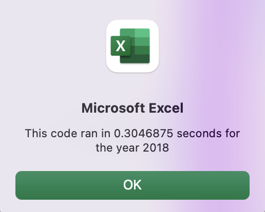
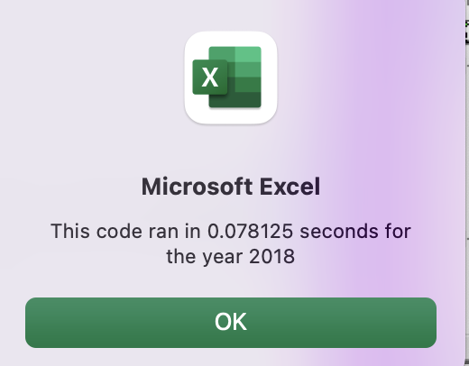

# stock-analysis

## Overview of Project

### Purpose

The purpose of this analysis is to use VBA to help our stakeholder research which stocks his parents should invest in. I used total daily volume and annual return as metrics.
The purpose of this challenge is to refactor the VBA script so that it can be more efficient in order for the stakeholder to expand the dataset to thousands of stocks rather than only a dozen. 

## Results

### Analysis 

To refactor the VBA script, I needed to change the logic of the code as well as where the calculations were stored. To change the logic I initiated **tickerIndex** to ensure that the index aligned across the 4 different arrays. In this code I used 4 arrays to hold the outputs of **tickers** ,  **tickerVolumes** , **tickerStartingPrices**, and **tickerEndingPrices**. These last two arrays were used to calculate the annual return. I refactored the code using the variable and arrays as my foundation for nested for loops and conditionals. 

The lines of code displayed below show the changes implemented in the refactored code. 

    
    '1a) Create a tickerIndex variable
        
        Dim tickerIndex As Single
        tickerIndex = 0

    '1b) Create three output arrays
    
    Dim tickerVolumes(12) As Long
    Dim tickerStartingPrices(12) As Single
    Dim tickerEndingPrices(12) As Single
    

    
       
    ''2a) Create a for loop to initialize the tickerVolumes to zero.
    
    For i = 0 To 11
        
        tickerVolumes(i) = 0
   
     Next i
 
        '2b) Loop over all the rows in the spreadsheet.
        For j = 2 To rowCount
        

       
                
                '3a) Increase volume for current ticker
                
    tickerVolumes(tickerIndex) = tickerVolumes(tickerIndex) + Cells(j, 8).Value
                
    
        
        
        '3b) Check if the current row is the first row with the selected tickerIndex.
       'If  Then
        
             If Cells(j, 1).Value = tickers(tickerIndex) And Cells(j - 1, 1).Value <> tickers(tickerIndex) Then
            
                tickerStartingPrices(tickerIndex) = Cells(j, 6).Value
                
            
        
            End If
        
        '3c) check if the current row is the last row with the selected ticker
         'If the next row’s ticker doesn’t match, increase the tickerIndex.
        'If  Then
        
            If Cells(j, 1).Value = tickers(tickerIndex) And Cells(j + 1, 1).Value <> tickers(tickerIndex) Then
            
                tickerEndingPrices(tickerIndex) = Cells(j, 6).Value
                
        
                
            
        
                '3d Increase the tickerIndex.
                tickerIndex = tickerIndex + 1
            
            End If
        
            
            
    
        Next j
        
    
    '4) Loop through your arrays to output the Ticker, Total Daily Volume, and Return.
        
    For i = 0 To 11
    
        tickerIndex = i
    
        Worksheets("All Stocks Analysis").Activate
        
        Cells(4 + i, 1).Value = tickers(tickerIndex)
    
        Cells(4 + i, 2).Value = tickerVolumes(tickerIndex)
    
        Cells(4 + i, 3).Value = (tickerEndingPrices(tickerIndex) / tickerStartingPrices(tickerIndex)) - 1
        
    Next i

The result of refactoring this way was a much faster VBA script.

Here is just one example of the difference in run Time -- refactored time was only a small fraction of orginal time. 

#### VBA Original Script Run Time

#### VBA Refactored Script Run Time

## Summary 

### Advantages and Disadvantages of Refactoring Code in General

An advantage of refactoring code in general is that you create better efficiency for your code by using less memory, taking less steps, and improving the logic of the code. Disadvantages of refactoring include not understanding what the existing working code is doing and breaking perfectly good code.

### Statement of Advantages and Disadvantages of the original and refactored VBA Script

The advantages of refactoring the original script is that the refactored script was cleaner and proved to be more time-efficient than the original VBA script by the difference in outputted time. The disadvantage of the refactored script is that, in my opinion, the original script is great for beginners because it is more rudimentary and takes the developer step by step. 

